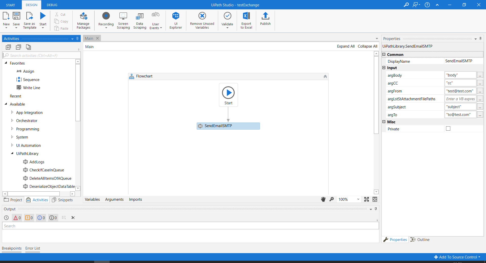

# UiPath Workflows to Libs
## Inspiration
One of the best features we had in the latest version of UiPath was the ability to create customized libraries. Prior to this, we were using reusable components by invoking workflow files. 

Once we created our libraries, we had to update the existing code of all the robots to ensure that they were using our brand new and shiny libraries - and we didn't want to do this manually!

## What it does

We convert workflows calls to library calls.

### Before
```xml
<ui:InvokeWorkflowFile ContinueOnError="{x:Null}" sap2010:Annotation.AnnotationText="Precondition: ME52N Transacion visible.&#xA;&#xA;Actions:&#xA;1.Converting JSON to DataTable to obtain the whole data from the PR - coming from reports&#xA;&#xA;" DisplayName="Deserialize object from Queue" sap2010:WorkflowViewState.IdRef="InvokeWorkflowFile_3" UnSafe="False" WorkflowFileName="[assetUiPathLibraryPath+&quot;DeserializeObjectDataTable.xaml&quot;]">
  <ui:InvokeWorkflowFile.Arguments>
    <InArgument x:TypeArguments="x:String" x:Key="argJSONComing">[argTransactionItem.SpecificContent("DtPR").ToString]</InArgument>
    <OutArgument x:TypeArguments="sd:DataTable" x:Key="argObjectOutput">[DtPRLines]</OutArgument>
  </ui:InvokeWorkflowFile.Arguments>
</ui:InvokeWorkflowFile>
```

### After
```xml
<uilib:DeserializeObjectDataTable argJSONComing="[argTransactionItem.SpecificContent(&quot;DtPR&quot;).ToString]" argObjectOutput="[DtPRLines]"/>
```

## How we built it
We developed a Python script that reads the XML DOM of `.xaml` files and process it converting workflow calls to library calls. First, we find out which are the namespaces of the current workflow files along with their input and output arguments. Then, we replace the workflow call with the library call adding those arguments. Finally, the input `.xaml` is overwritten with the new XML DOM structure.

In our case, we had three different libraries to interact with different systems. UiPath, SAP and ServiceNow. However, this script can be easily extended with your own libraries.

## Video demo
[](https://www.youtube.com/watch?v=KxbKylV1qHY "UiPath Worfklows to Libs Video Demo")

## User guide

### Requirements
- Install Python 3 (https://www.python.org/downloads/release/python-368/)

### How to use this project

1. Create or open an UiPath project with workflow invocation activities that make calls to your own libraries. For instance, we have created a new project that invokes a function called **SendSMTP** that belongs to our custom UiPath library.


2. Now, clone this repository: https://github.com/mccm-innovations/UiPath_Workflows_To_Libs. It contains a Python script that will convert workflow invocations to direct library calls so that we are going to get rid off using reusable components by invoking workflow files within our old UiPath projects.

3. Run the following command replacing `PATH_TO_DIRECTORY_WITH_XAML_FILES` with your directory path where `.xaml` files are localised.
```bash
python replace_workflow_for_lib_calls.py -d PATH_TO_DIRECTORY_WITH_XAML_FILES
```


4. Finally, open your converted project and check that your old workflow invocation activity has been replaced correctly.


#### Important note
We have tested this tool with three different libraries that we have developed to interact with UiPath, SAP and ServiceNow:

- 'xmlns:uilib', 'clr-namespace:UiPathLibrary;assembly=UiPathLibrary'
- 'xmlns:saplib', 'clr-namespace:SAP_Library;assembly=SAP_Library'
- 'xmlns:snlib', 'clr-namespace:ServiceNow_Library;assembly=ServiceNow_Library'

You can easily extend this Python script with your own libraries adding them to the following lines:

- [https://github.com/mccm-innovations/UiPath_Workflows_To_Libs/blob/master/replace_workflow_for_lib_calls.py#L21-L26](https://github.com/mccm-innovations/UiPath_Workflows_To_Libs/blob/master/replace_workflow_for_lib_calls.py#L21-L26)
- [https://github.com/mccm-innovations/UiPath_Workflows_To_Libs/blob/master/replace_workflow_for_lib_calls.py#L48-L54](https://github.com/mccm-innovations/UiPath_Workflows_To_Libs/blob/master/replace_workflow_for_lib_calls.py#L48-L54)
